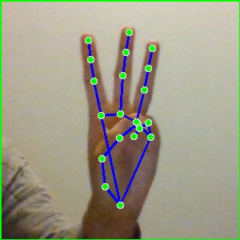

# CodeWithKiroHackathon

# 🤟 Hindi Sign Language Recognition

A real-time **Hindi Sign Language Recognition System** that translates hand gestures into **Hindi characters**, represented as **English transliterations** or **phonetic sounds for pronunciation** with a model accuray of 92%.

This project was created for the **Code With Kiro Hackathon (Best Wildcard / Freestyle Category)**. It highlights how **AI can promote inclusivity, accessibility, and diversity** ensuring that technology benefits everyone, regardless of language or ability.

---

## 🌟 Introduction

Most sign language systems in AI focus on narrow datasets, leaving speakers of many languages underrepresented. To address this, I **self-created a dataset of 11,025 samples across 49 classes**.

* This dataset is **not publicly available**, as it was curated specifically for this project.
* Each sample was generated by capturing a hand gesture and processing it through **MediaPipe**.
* MediaPipe extracted **keypoints (landmarks)** and connected them into a **skeleton-like representation** of the hand (points + lines).
* Instead of raw hand photos, the dataset contains these **skeletonized images**, which makes the model:

  * Less biased by skin tone, background, or lighting.
  * More robust and generalizable.
  * Privacy-preserving.
 
    
An example of one the images used in dataset is -




This project shows that **AI is meant for everyone**, bringing people closer by bridging communication barriers through gestures and language.

---

## 🛠️ Features

* 📷 Real-time hand gesture recognition via webcam.
* 🧠 Custom CNN model trained on **49 Hindi gestures**.
* 🔡 **Two Output Modes:**

  * **Transliteration** → Direct Hindi-to-English script (e.g., क → k).
  * **Phonetic Pronunciation** → Hindi sound written in English letters (e.g., क → “ka”).
* 🎯 Dataset created using **MediaPipe skeleton keypoints** instead of raw images.
* 🧩 Built with **MediaPipe, TensorFlow, and Python**.
* 🌐 Modular design ready for extension into other languages.

---

## 🔡 Hindi-to-English Phonetic Mapping (Examples)

| Hindi Letter | Transliteration | Phonetic Sound (English) |
| ------------ | --------------- | ------------------------ |
| अ            | a               | “uh” (as in *cup*)       |
| आ            | aa              | “aa” (as in *car*)       |
| क            | k               | “ka”                     |
| ग            | g               | “ga”                     |
| म            | m               | “ma”                     |
| श            | sh              | “sha”                    |

*(Full mapping for all 49 classes is implemented in the code.)*

---

## 🧠 Model Architecture & Performance

The recognition model is a **Convolutional Neural Network (CNN)** built specifically for skeletonized gesture classification.

**CNN Structure:**

* **Input Layer:** Skeletonized hand images from MediaPipe keypoints.
* **Conv2D Layer 1:** 32 filters, 3×3 kernel, ReLU activation.
* **MaxPooling Layer 1:** 2×2 pool size.
* **Conv2D Layer 2:** 64 filters, 3×3 kernel, ReLU activation.
* **MaxPooling Layer 2:** 2×2 pool size.
* **Flatten Layer**.
* **Dense Layer 1:** 128 neurons, ReLU activation.
* **Dropout Layer:** 0.5 (to reduce overfitting).
* **Dense Layer 2 (Output):** 49 neurons, Softmax activation (for 49 classes).

**Performance:**

* Achieved **92% accuracy** on the validation set.
* Balanced recognition across all 49 classes.
* Optimized for **real-time inference** using TensorFlow and GPU acceleration.

This accuracy demonstrates the **strength of using skeletonized MediaPipe data** combined with CNNs.

---

## 🚀 Future Improvements

Planned enhancements include:

* **Sentence Builder:** Combine recognized letters into words and full sentences.
* **Multi-Language Mode:** Output sentences in both Hindi & English.
* **Pronunciation Extension:** Expand phonetic mapping for better non-native accessibility.
* **Text-to-Speech (TTS):** Convert recognized sentences into natural speech.
* **Custom Gestures:** Let users define and map their own gestures.

---

## 🤖 Built with Kiro

This project was developed using **Kiro**, an AI-powered development assistant that supported me throughout the entire lifecycle from idea conception to deployment. Kiro acted like a **teammate**, helping me **plan, code, debug, and refine**.

### 🧠 How I Used Kiro

#### 1. Vibe Coding for Ideation

* Shared my vision in plain language.
* Kiro brainstormed features like webcam-based recognition, modular dataset design, and phonetic mapping.
* Helped refine scope to **49 gestures, transliteration, and phonetics**.

#### 2. Spec-Driven Development

* Turned requirements into a **clear modular architecture**.
* Produced a **step-by-step task plan** for dataset → training → inference → app.
* Ensured alignment with the **Best Wildcard / Freestyle Category** theme.

#### 3. Steering Files for Consistency

* Applied my coding style, folder structure, and library preferences.
* Maintained **clean, modular, and reusable** code across the project.

#### 4. Advanced Code Generation

* Generated core components:

  * CNN for gesture classification.
  * Transliteration and phonetic mapping.
  * Data preprocessing and augmentation.
  * Unit tests and debugging utilities.
* Helped tune the CNN to reach **92% accuracy** while staying real-time.

#### 5. Workflow Automation

* Tracked progress and allowed **session resumption** seamlessly.
* Reduced overhead by keeping task context alive.

#### 6. Iterative Debugging & Refinement

* Suggested fixes for Unicode rendering, dataset balancing, and overfitting.
* Recommended multiple strategies, improving both accuracy and reliability.

#### 7. Hackathon Readiness

* Assisted with **README drafting, documentation**, and impact storytelling.
* Strengthened the **social good narrative**, emphasizing inclusivity and diversity.

---

## 💡 Impact

This project is an example of how AI can be a tool for **social good** not just efficiency.

* Celebrates **linguistic diversity**.
* Provides **assistive communication tools** for disabled communities.
* Bridges **cultural and linguistic gaps**.
* Shows that **AI belongs to everyone**, not just a select few.

By combining **technical innovation** with **social purpose**, this project demonstrates AI as a **force for empathy and inclusion**.

---

## 📁 Project Structure

```
├── dataset/                # Custom Hindi gesture dataset (11,025 samples, 49 classes, MediaPipe skeletonized)
├── model/                  # CNN model + training scripts
├── mediapipe_utils/        # Keypoint extraction scripts
├── transliteration/        # Hindi to English mapping
├── pronunciation/          # Hindi sounds in English phonetic style
├── app.py                  # Main application script
└── README.md               # Project documentation
```

---

## 📜 License

This project is open source and available under the [MIT License](LICENSE).

